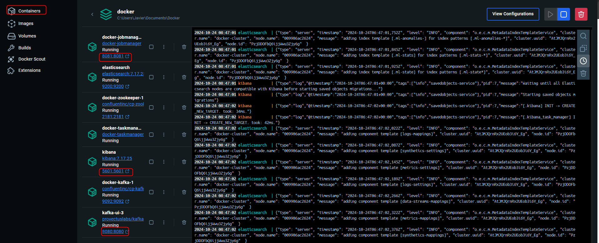
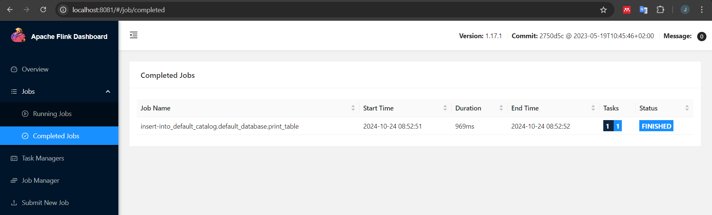

# Commands


First, Docker Desktop must be open.
```
docker-compose up -d
```

Once the container have been created, you can open the UI of each container.



Next, the jobmanager container is opened where the scripts will be executed.
```
docker exec -it docker-jobmanager-1 bash
```

The scripts are in `tmp/scripts/`, there you have to choose a script to run.
```
cd /tmp/scripts
```

For example, `/01TablesCreation/code01.py`
```
cd 01tablesCreation
flink run -py code01.py
```
Output:
```
root@20a4949f2011:/tmp/scripts/01tablesCreation# flink run -py code01.py
WARNING: An illegal reflective access operation has occurred
WARNING: Illegal reflective access by org.apache.flink.api.java.ClosureCleaner (file:/opt/flink/lib/flink-dist-1.17.1.jar) to field java.util.LinkedHashMap.serialVersionUID
WARNING: Please consider reporting this to the maintainers of org.apache.flink.api.java.ClosureCleaner
WARNING: Use --illegal-access=warn to enable warnings of further illegal reflective access operations
WARNING: All illegal access operations will be denied in a future release
Job has been submitted with JobID 18a3708c5c9ffd42a52d22e1991aa4df
```

The job has been submmitted, in the Flink UI you can see the job created



